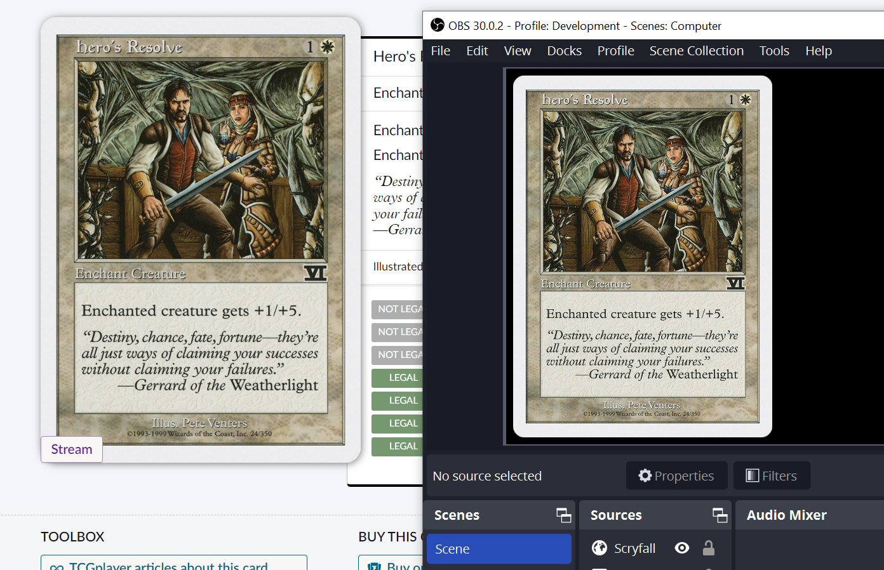

# https://bigdeck.pics

See more information about usage at [BigDeck.pics](https://bigdeck.pics)

### Description

Web Extension + Server to facilitate updating an OBS Browser Source with Scryfall card images.

- Server exposes resource endpoints to update image url for a given identifier.
- Browser Source subscribes to changes on that resource via WebSockets.

### Areas for Enhancement

- Optional Authentication.
- Increase user-friendliness of configuration.
- Expand image url parsing + enrichment.
- Queuing of images.
- Support for decklist pages.
- Expand support to other websites.
- Handle alternate assignment patterns, such as by card name.
- Some sort of persistence to allow restoring images after a server restart.
- Better memory cleanup of abandoned identifiers.
- Publish for Firefox. 
